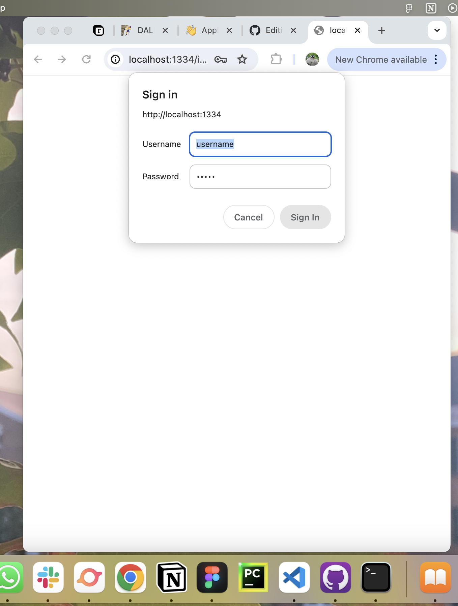

# Contents

1. [About my project 🌱](#about-my-project-)
2. [How to run on your local machine 💻](#how-to-run-on-your-local-machine-)
3. [Demo 🚀](#demo-)
4. [Future features!! 🌠](#future-features-)
   - [dev](#-dev-)
   - [UI/UX & graphics](#-des-)

# About my project 🌱
[HTML demo here.](https://yawenx2004.github.io/portfolio-site-static/index.html)

Welcome to my Node.js portfolio! 🌟 This is where I showcase my projects, skills, and experiences as a web developer and UI/UX designer. 🌻🌿

This is absolutely still a work in progress (and I'm spending way too much time on this instead of my actual CS classes but it's been incredibly fun </3), but here are the current features as of 22 April 2024:

- **portfolio** (🚧 under construction): built on a responsive grid layout; showcases my projects
- **resume**: here you can view and/or download a copy of my resume (last update sometime in April 2024)
- **about page**: contains an intro & weather data (retrieved from [OpenWeather](https://openweathermap.org/)) of places I am from
- **"blog"** (🚧 under construction): my "thoughts;" currently running on local storage, with a capacity of one (1) entry exactly; this can be edited through a password-protected internal page.

Directory structure:

- **index.js** is the entry point of my application
- **src** houses my HTML documents
- **style** houses my CSS file

# How to run on your local machine 💻
1. Clone repository from GitHub
2. Type the following commands into the terminal:
3. To test blog functionality, go to internal.html (scroll down; it's the bottom link on the footer), and type in the password; you will then be able to access the blog editor form.
```bash
npm install
npm run dev
```

# Demo 🚀
You can find [here](https://yawenx2004.github.io/portfolio-site-static/index.html) an HTML-only preview of my website. Please note that this preview has limited functionality and does not include all the features present in this version.

This demo is notably missing the password-protection feature for internal.html, so here is what happens—

1. Click the link to the interal page (scroll down to the footer); you should see the password input prompt pictured below:
2. If you click cancel, you'll be directed to the home page; if you enter the wrong password, the form will refresh; if you enter the correct password, you'll be able to access /internal.
3. See changes reflected in /journal!



# Future features!! 🌠
### 🌟 dev 🌟
- actully build each part of the portfolio
- host blog & portfolio entries in SQL database; currently everything is in local storage
- make build script more functional
- deploy deploy deploy

### 🌟 des 🌟
- remake the weather icons; right now I'm using the [default](https://openweathermap.org/weather-conditions), but I'd like to have versions that mesh better with the overall UI of the site
- draw my pfp, in the style of the strawberries icon; replace the photo with this art
- re-evaluate spacing & divider decisions
- make buttons less wobbly! right now they push other elements around when I hover
